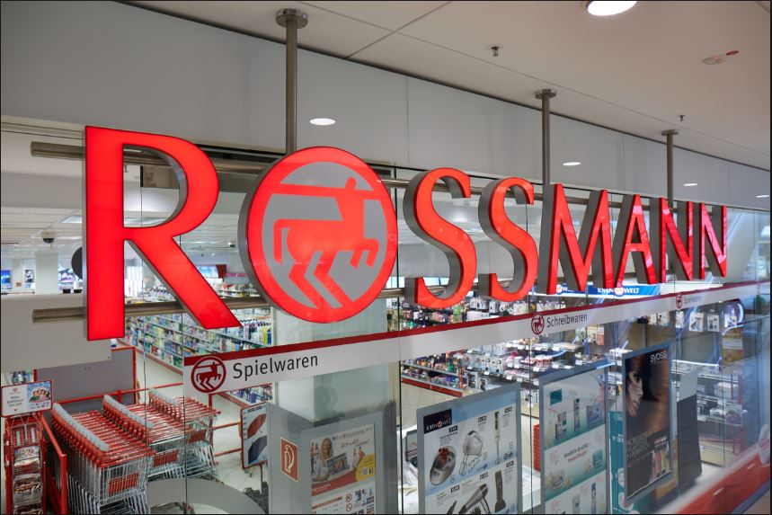

# Rossmann Sales Prediction Model 

## Overview

Rossmann operates over 3,000 drug stores in 7 European countries. Currently, Rossmann store managers are tasked with predicting their daily sales for up to six weeks in advance. Store sales are influenced by many factors, including promotions, competition, school and state holidays, seasonality, and locality. With thousands of individual managers predicting sales based on their unique circumstances, the accuracy of results can be quite varied.

Rossmann is challenging you to predict 6 weeks of daily sales for 1,115 stores located across Germany. Reliable sales forecasts enable store managers to create effective staff schedules that increase productivity and motivation.

## What kind of problem to solve?

This task can be seen as regression or time series problem. Here we propose regression method with embedding features method to mine the data information.

## Dataset

- We put the dataset in `gs://ml-specialized/rossmann/data`.
- Detail description about dataset see [rossmann.ipynb](./rossmann.ipynb).

## EDA(Exploratory Data Analysis), Running Code, Model Structure, Training, Eval Tips

We put almost code in `.py` scripts rather than jupyter notebook, in notebook we demonstrate how to EDA, and how to run code 
step by step, see [rossmann.ipynb](./rossmann.ipynb) for detail.

